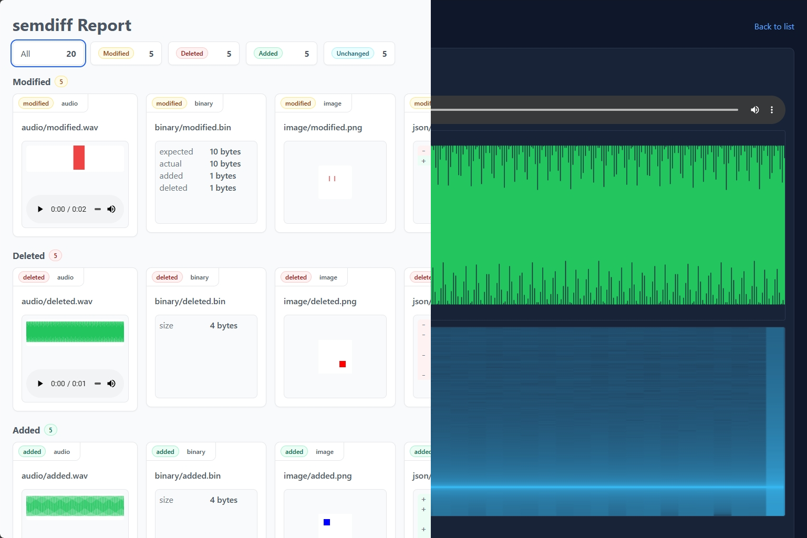

# semdiff

`semdiff` is a semantic diff tool for comparing files and directories. It walks two directory trees, detects file types, and produces human-friendly reports for text, JSON, binary, image, and audio differences.



HTML report example: https://white-green.github.io/semdiff

## Features

- Compare files or directories (`expected` vs `actual`).
- Diff types: text, JSON, binary, image, and audio. (Additional suggestions are welcome.)
- Report outputs:
  - Summary (stdout)
  - JSON (stdout or file)
  - HTML (file + detail pages)
- Tuning options for JSON key order, image pixel tolerance, and audio alignment/thresholds.

## Installation

### From crates.io

```bash
cargo install semdiff-cli --locked
```

### From source

```bash
cargo build --release
```

The binary will be available at `target/release/semdiff`.

## Usage

```bash
semdiff <expected> <actual>
```

### Output selection

- **Summary (default):** omit `--output` and `--format`
- **JSON:** `--format json` (writes to `--output` if provided; otherwise stdout)
- **HTML:** `--format html` and an `--output` path ending in `.html`

### Common examples

```bash
# Summary to stdout
semdiff ./sample_data/expected ./sample_data/actual

# HTML report
semdiff ./sample_data/expected ./sample_data/actual --output ./test/index.html

# JSON report to stdout
semdiff ./sample_data/expected ./sample_data/actual --format json
```

## Options

```
<EXPECTED>                               Path to the expected input file or directory
<ACTUAL>                                 Path to the actual input file or directory
--output <PATH>                           Output path for JSON/HTML reports; if omitted, prints a summary to stdout
--format <json|html>                      Output format; if omitted, inferred from --output extension or defaults to summary
--json-ignore-object-key-order            Ignore object key order when comparing JSON
--image-max-distance <FLOAT>              Max OkLab+alpha distance to treat two image pixels as equal
--image-max-diff-ratio <FLOAT>            Max ratio of differing pixels to treat images as equal
--audio-shift-tolerance-seconds <FLOAT>   Max allowed temporal shift (seconds) when aligning audio
--audio-lufs-tolerance-db <FLOAT>         Max LUFS difference in dB to treat audio as equal
--audio-spectral-tolerance <FLOAT>        Per-bin spectral magnitude tolerance for audio comparison
--audio-spectrogram-diff-rate-tolerance <FLOAT>
                                         Max ratio of differing spectrogram bins to treat audio as equal
```

## Workspace crates

- `semdiff-cli`: Command-line interface
- `semdiff-core`: Traversal and diff/reporting traits
- `semdiff-differ-*`: Diff calculators and reporters per data type
- `semdiff-output`: HTML/JSON/summary output writers

## License

Licensed under either of:

- Apache License, Version 2.0
- MIT license
